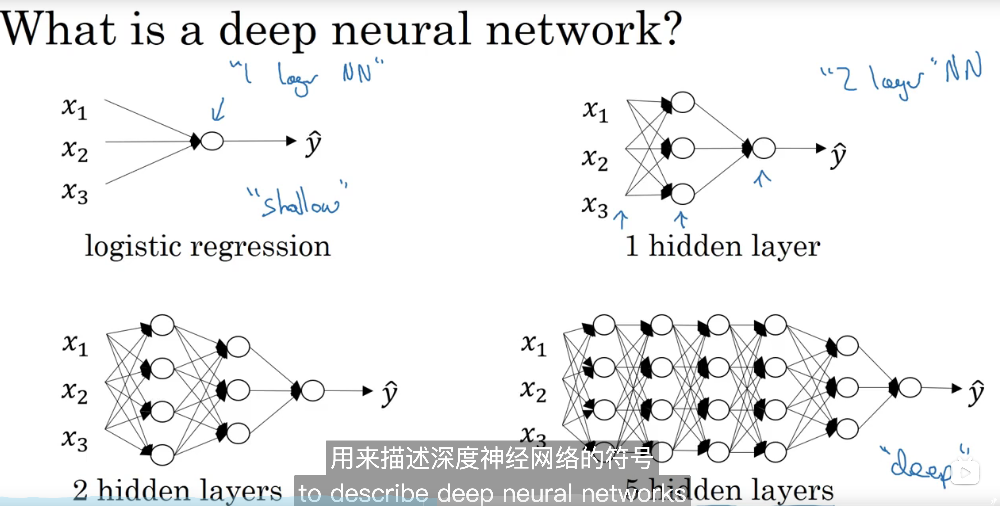
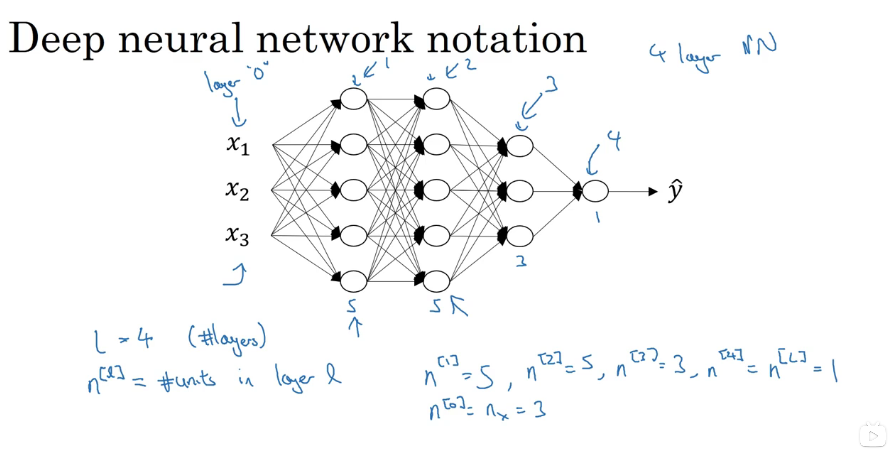
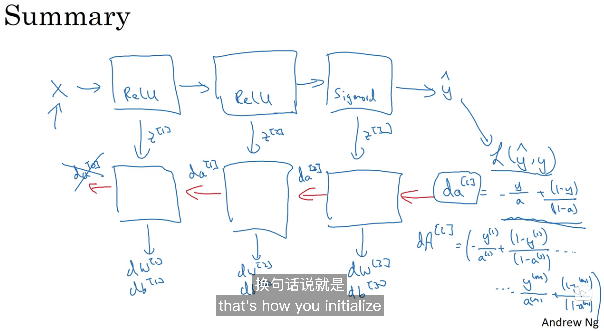
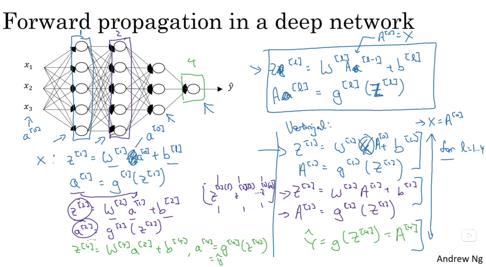
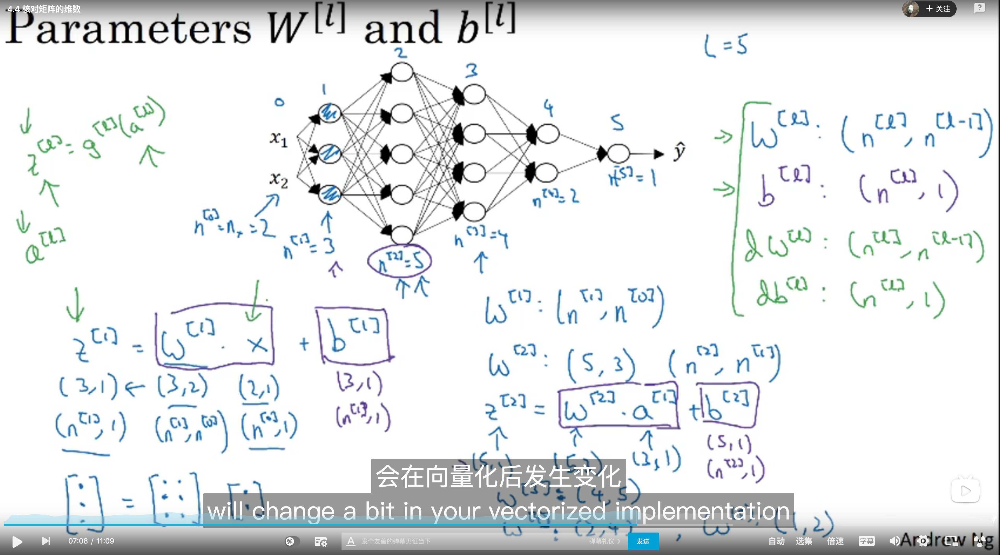
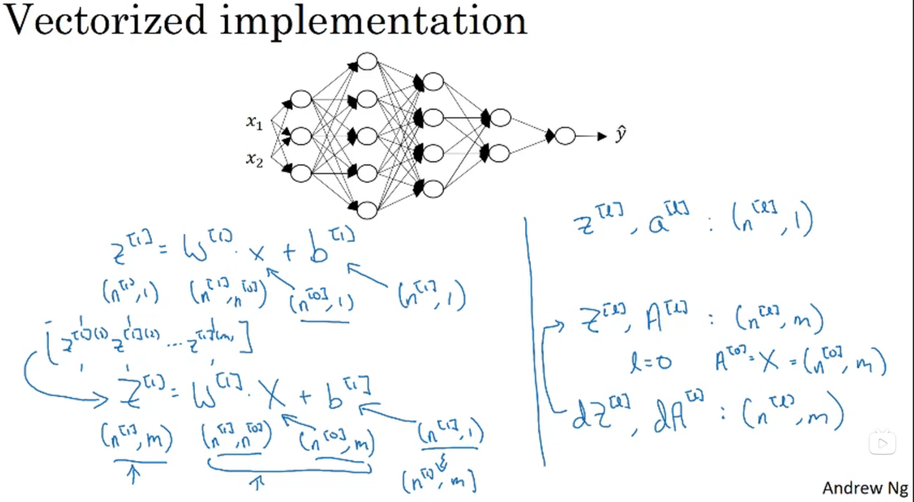
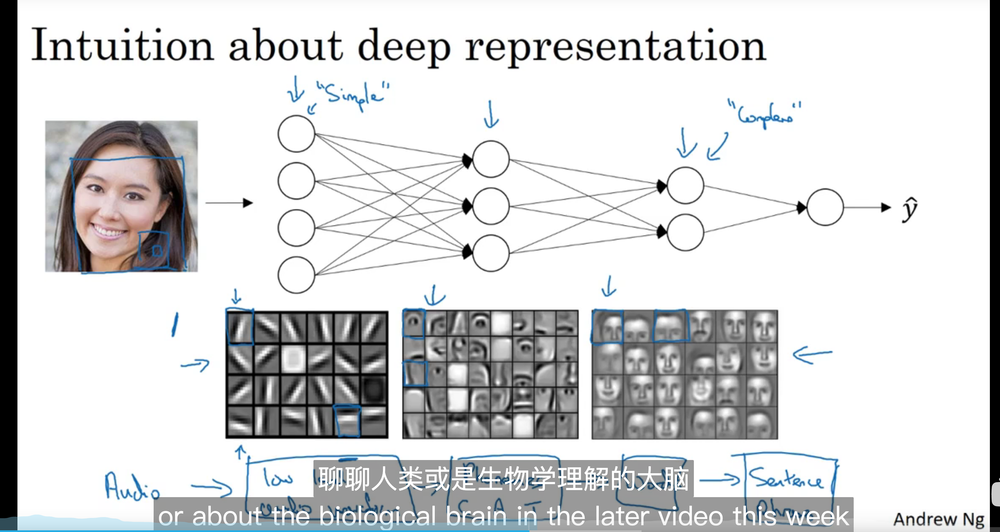
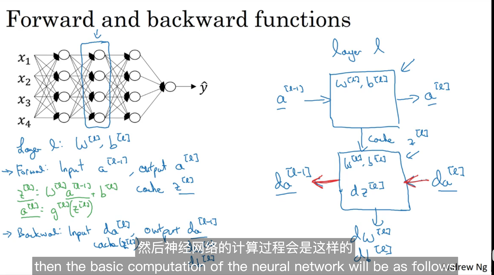
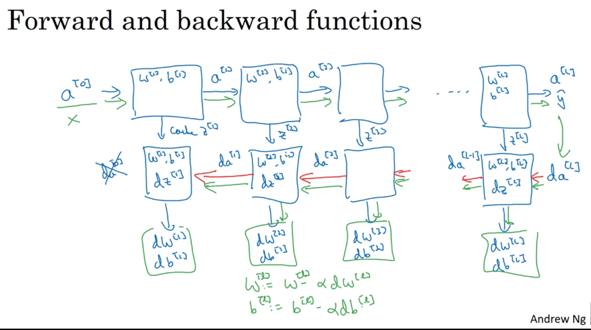
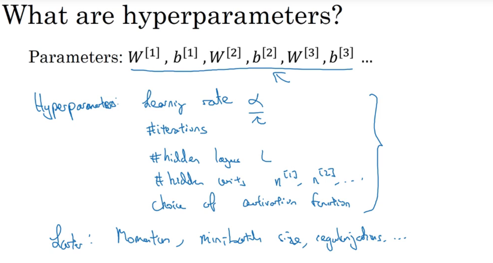

# 4. Deep Neual Networks

## 4.1 Deep L-layer Neual network

$a^[l] = activations \ in \ layer \ l$

$a^[l] = g^{[l]}(z[l])$

$z[l] = \theta^Ta[l-1]$

$w^{[l]} = weight \ for \ z[l]$

## 4.2 Forward and backward propagation

### **Forwad propagation for layer l**

**Input $a^{[l-1]}$**

**Output** : $a^{[l]}, cache(z^{[l]}), w^{[l]}, b^{[l]}$

and
$$
z^{[l]} = W^{[l]}a^{[l - 1}] + b^{[l]}
$$

$$
a^{[l]} = g^{[l]}(z^{[l]})
$$

**Vectorized:**
$$
Z^{[l]} = W^{[l]}A[l-1] + b[l]
$$

$$
A[l] = g^{[l]}(Z[l])
$$

A[0] is the entire traning, so if you are processing the entire training set, so that's the input to the first forward function in the chain, and then just repeating this allows you to compute forward propagation from left to right

### Backwoard propagation for layer l

**Input:** $da^{[l]}$

Output: $da^{[l - 1]}, dW^{[l]}, db^{[l]}$

To:
$$
dz^{[l]} = da^{[l]} * g^{[l]'}(z^{[l]})
$$

$$
dw^{[i]} = dz^{[l]}a^{[l-1]}
$$

$$
db^{[l]} = dz^{[l]}
$$

$$
da^{[l - 1]} = w^{[l]T}dz^{[l]}
$$

**Vevtorized:**
$$
dZ^{[l]} = dA^{[l]} * g^{[l]'}(Z^{[l]})
$$

$$
dW^{[i]} = \frac{1}{m}dZ^{[l]}A^{[l-1]}
$$

$$
db^{[l]} =\frac{1}{m}np.sum(dz^{[l]}, axis = 1, keepdims=True)w
$$

$$
dA^{[l - 1]} = W^{[l]T}dZ^{[l]}
$$

## 4.3 Forward Propagation in a deep network

## 4.4 Getting your matrix dimensions right(Important)

## 4.5 Why deep representations?

## 4.6 Building blocks of deep neural networks

## 4.7 Parameters VS Hyperparameters

## 4.8 What does this have to do with the brain?

略