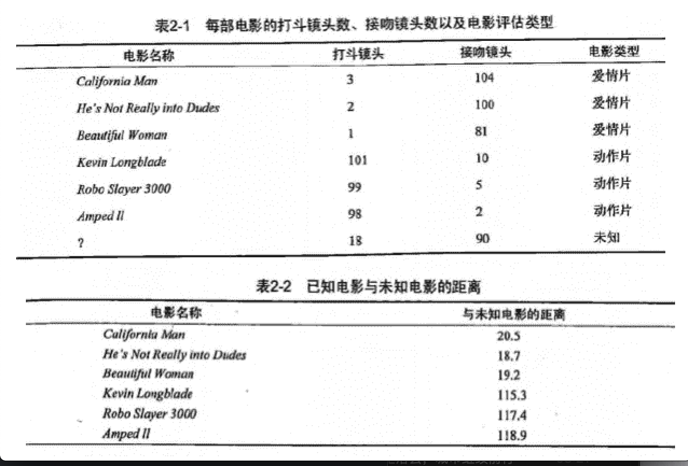

# 转载

- **作者: [羊三](http://cwiki.apachecn.org/display/~xuxin) [小瑶](http://cwiki.apachecn.org/display/~chenyao)**
- [GitHub地址](https://github.com/apachecn/AiLearning): https://github.com/apachecn/AiLearning
- **版权声明: 欢迎转载学习 => 请标注信息来源于 [ApacheCN](http://www.apachecn.org/)**


# 第2章 k-近邻算法

## KNN 概述

k-近邻（kNN, k-NearestNeighbor）算法是一种基本分类与回归方法，我们这里只讨论分类问题中的 k-近邻算法。

k 近邻算法的输入为实例的特征向量，对应于特征空间的点；输出为实例的类别，可以取多类。

k 近邻算法假设给定一个训练数据集，其中的实例类别已定。分类时，对新的实例，根据其 k 个最近邻的训练实例的类别，通过多数表决等方式进行预测。因此，k近邻算法不具有显式的学习过程。

## KNN 场景

电影可以按照题材分类，那么如何区分 `动作片` 和 `爱情片` 呢？

1. 动作片: 打斗次数更多
2. 爱情片: 亲吻次数更多

基于电影中的亲吻、打斗出现的次数，使用 k-近邻算法构造程序，就可以自动划分电影的题材类型。



```
现在根据上面我们得到的样本集中所有电影与未知电影的距离，按照距离递增排序，可以找到 k 个距离最近的电影。
假定 k=3，则三个最靠近的电影依次是， He's Not Really into Dudes 、 Beautiful Woman 和 California Man。
knn 算法按照距离最近的三部电影的类型，决定未知电影的类型，而这三部电影全是爱情片，因此我们判定未知电影是爱情片。
```


## KNN 原理

>  KNN 工作原理

1. 假设有一个带有标签的样本数据集（训练样本集），其中包含每条数据与所属分类的对应关系。
2. 输入没有标签的新数据后，将新数据的每个特征与样本集中数据对应的特征进行比较。
   1. 计算新数据与样本数据集中每条数据的距离。
   2. 对求得的所有距离进行排序（从小到大，越小表示越相似）。
   3. 取前 k （k 一般小于等于 20 ）个样本数据对应的分类标签。
3. 求 k 个数据中出现次数最多的分类标签作为新数据的分类。

>  KNN 通俗理解

给定一个训练数据集，对新的输入实例，在训练数据集中找到与该实例最邻近的 k 个实例，这 k 个实例的多数属于某个类，就把该输入实例分为这个类。

>  KNN 开发流程

```
收集数据: 任何方法
准备数据: 距离计算所需要的数值，最好是结构化的数据格式
分析数据: 任何方法
训练算法: 此步骤不适用于 k-近邻算法
测试算法: 计算错误率
使用算法: 输入样本数据和结构化的输出结果，然后运行 k-近邻算法判断输入数据分类属于哪个分类，最后对计算出的分类执行后续处理
```

> KNN 算法特点

```
优点: 精度高、对异常值不敏感、无数据输入假定
缺点: 计算复杂度高、空间复杂度高
适用数据范围: 数值型和标称型
```

 

## KNN项目实例1

优化约会网站的配对效果

**概述：**

Helon使用约会网站约会对象，经过一段时间，发现交往过三类人：

- 不喜欢的人
- 魅力一般
- 极具魅力的人

然后她收集了一些约会网站未曾记录的数据信息，有助于匹配对象的归类。

**开发流程：**

```
1. 收集数据： 提供文本文件
2. 准备数据： 使用python解析文本文件
3. 分析数据： 使用Matplotlib 画二维散点图
4. 训练算法： 此步骤不适用于KNN近邻算法
5. 测试算法： 使用黑轮提供的部分数据作为测试样本。
	测试样本和非测试样本的区别在于：
		测试样本是已经完成分类的数据，如果预测分类与实际类别不同，则标记为一个错误。
6. 使用算法： 产生简单的命令行程序，然后可以输入一些特征数据以判断对方是否为自己喜欢的类型。
```

**1. 收集数据**

Helon将约会对象的数据存放在文本文件datingTestSet2.txt中， 一共有1000行。

Helon约会的对象主要包含以下3种特征：

- 每年获得的飞行常客里程数
- 玩视频游戏所耗时间百分比
- 每周消费的冰淇淋公升数

文本文件的数据格式如下：

```
40920	8.326976	0.953952	3
14488	7.153469	1.673904	2
26052	1.441871	0.805124	1
75136	13.147394	0.428964	1
38344	1.669788	0.134296	1
```

**2.  使用python解析文本文件**

将文本记录转换为numpy的解析程序

```python
def file2matrix(filename):
    """
    导入训练数据
    :param filename: 数据文件路径
    :return: 数据矩阵returnMat和对应的类别classLabelVector
    """
    fr = open(filename)
    # 获得文件中的数据行的行数
    numberOfLines = len(fr.readlines())
    # 生成对应的空矩阵
    # 例如: zeros(2，3)就是生成一个 2*3的矩阵，各个位置上全是 0 
    returnMat = zeros((numberOfLines, 3))  # prepare matrix to return
    classLabelVector = []  # prepare labels return
    fr = open(filename)
    index = 0
    for line in fr.readlines():
        # str.strip([chars]) --返回移除字符串头尾指定的字符生成的新字符串
        line = line.strip()
        # 以 '\t' 切割字符串
        listFromLine = line.split('\t')
        # 每列的属性数据
        returnMat[index, :] = listFromLine[0:3]
        # 每列的类别数据，就是 label 标签数据
        classLabelVector.append(int(listFromLine[-1]))
        index += 1
    # 返回数据矩阵returnMat和对应的类别classLabelVector
    return returnMat, classLabelVector
```

