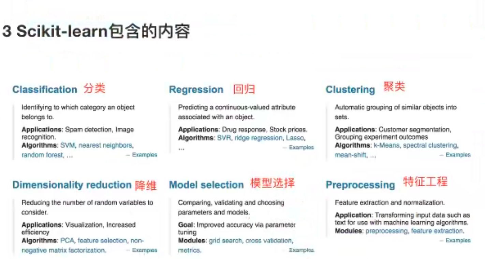
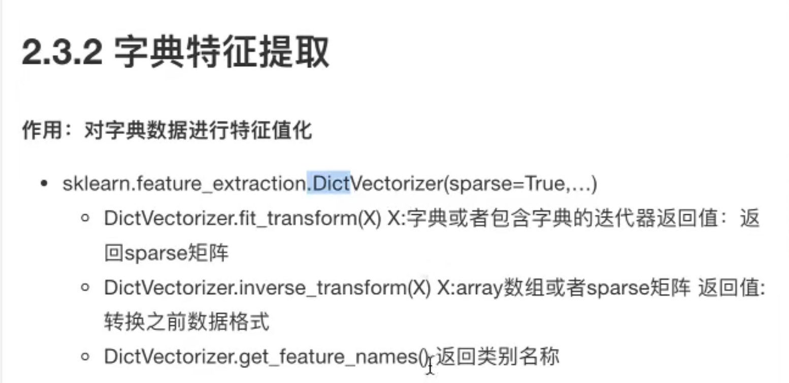
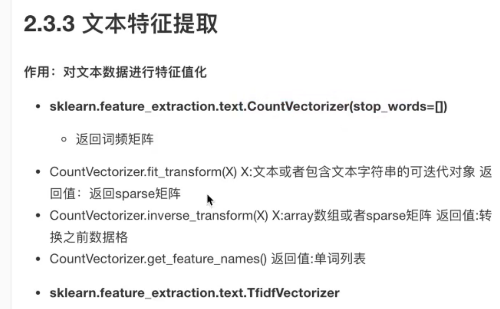
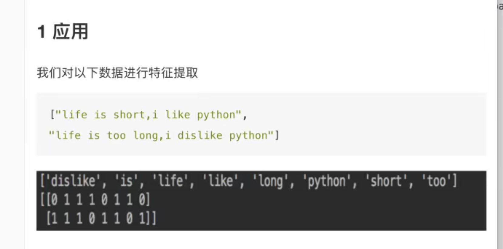

分类：

1. 监督学习

   目标值： 类别- 分类问题

   K- 近邻算法、贝叶斯分类、决策树与随机森林、逻辑回归

   ​	目标值： 连续型的数据 - 回归问题

   线性回归、岭回归

2. 目标值： 无 - 无监督学习

   聚类 k-means

流程：

1. 获取数据
2. 数据处理
3. 特征工程
4. 机器学习算法进行训练 - 模型
5. 模型评估  好： 应用， 不好： 回到数据处理
6. 应用


数据集：

学习阶段可用数据集：

1. scikit-learn 
2. kaggle
3. UCI


## Scikit-learn 工具介绍

1. python语言工具
2. 文档丰富
3. 丰富的api




加载数据集

```
load_*
fetch_*()
```


```
load和fetch返回的数据类型是datasets.base.Bunch（字典格式）
- data: 特征数据组， 是二维的[n_samples * n_features]
	numpy.ndarry 数组
- target: 标签数组， 是n_samples的一纬numpy.ndarray数组
- DESCR: 数据描述
- feature_names: 特征名
- target_name: 标签名
```

**code:**

```
# coding=utf-8
# Press the green button in the gutter to run the script.
from sklearn.datasets import load_iris

def datasets_demo():
    """
    sklearn 数据集使用
    :return:
    """

    # 获取数据机
    iris = load_iris()
    print("鸢尾花数据集")
    print("描述" +  iris["DESCR"])

    print("特征名称:")
    print(iris.feature_names)

    print("查看特征值:")
    print(iris.data, iris.data.shape)

    return None


if __name__ == '__main__':

    datasets_demo()
```

**print result:**

```java
/Users/crazys/PycharmProjects/pythonProject/venv/bin/python /Users/crazys/PycharmProjects/pythonProject/day01_ml.py
鸢尾花数据集
描述.. _iris_dataset:

Iris plants dataset
--------------------

**Data Set Characteristics:**

    :Number of Instances: 150 (50 in each of three classes)
    :Number of Attributes: 4 numeric, predictive attributes and the class
    :Attribute Information:
        - sepal length in cm
        - sepal width in cm
        - petal length in cm
        - petal width in cm
        - class:
                - Iris-Setosa
                - Iris-Versicolour
                - Iris-Virginica
                
    :Summary Statistics:

    ============== ==== ==== ======= ===== ====================
                    Min  Max   Mean    SD   Class Correlation
    ============== ==== ==== ======= ===== ====================
    sepal length:   4.3  7.9   5.84   0.83    0.7826
    sepal width:    2.0  4.4   3.05   0.43   -0.4194
    petal length:   1.0  6.9   3.76   1.76    0.9490  (high!)
    petal width:    0.1  2.5   1.20   0.76    0.9565  (high!)
    ============== ==== ==== ======= ===== ====================

    :Missing Attribute Values: None
    :Class Distribution: 33.3% for each of 3 classes.
    :Creator: R.A. Fisher
    :Donor: Michael Marshall (MARSHALL%PLU@io.arc.nasa.gov)
    :Date: July, 1988

The famous Iris database, first used by Sir R.A. Fisher. The dataset is taken
from Fisher's paper. Note that it's the same as in R, but not as in the UCI
Machine Learning Repository, which has two wrong data points.

This is perhaps the best known database to be found in the
pattern recognition literature.  Fisher's paper is a classic in the field and
is referenced frequently to this day.  (See Duda & Hart, for example.)  The
data set contains 3 classes of 50 instances each, where each class refers to a
type of iris plant.  One class is linearly separable from the other 2; the
latter are NOT linearly separable from each other.

.. topic:: References

   - Fisher, R.A. "The use of multiple measurements in taxonomic problems"
     Annual Eugenics, 7, Part II, 179-188 (1936); also in "Contributions to
     Mathematical Statistics" (John Wiley, NY, 1950).
   - Duda, R.O., & Hart, P.E. (1973) Pattern Classification and Scene Analysis.
     (Q327.D83) John Wiley & Sons.  ISBN 0-471-22361-1.  See page 218.
   - Dasarathy, B.V. (1980) "Nosing Around the Neighborhood: A New System
     Structure and Classification Rule for Recognition in Partially Exposed
     Environments".  IEEE Transactions on Pattern Analysis and Machine
     Intelligence, Vol. PAMI-2, No. 1, 67-71.
   - Gates, G.W. (1972) "The Reduced Nearest Neighbor Rule".  IEEE Transactions
     on Information Theory, May 1972, 431-433.
   - See also: 1988 MLC Proceedings, 54-64.  Cheeseman et al"s AUTOCLASS II
     conceptual clustering system finds 3 classes in the data.
   - Many, many more ...
特征名称:
['sepal length (cm)', 'sepal width (cm)', 'petal length (cm)', 'petal width (cm)']
查看特征值:
(array([[5.1, 3.5, 1.4, 0.2],
       [4.9, 3. , 1.4, 0.2],
       [4.7, 3.2, 1.3, 0.2],
       [4.6, 3.1, 1.5, 0.2],
       [5. , 3.6, 1.4, 0.2],
       [5.4, 3.9, 1.7, 0.4],
       [4.6, 3.4, 1.4, 0.3],
       [5. , 3.4, 1.5, 0.2],
       [4.4, 2.9, 1.4, 0.2],
       [4.9, 3.1, 1.5, 0.1],
       [5.4, 3.7, 1.5, 0.2],
       [4.8, 3.4, 1.6, 0.2],
       [4.8, 3. , 1.4, 0.1],
       [4.3, 3. , 1.1, 0.1],
       [5.8, 4. , 1.2, 0.2],
       [5.7, 4.4, 1.5, 0.4],
       [5.4, 3.9, 1.3, 0.4],
       [5.1, 3.5, 1.4, 0.3],
       [5.7, 3.8, 1.7, 0.3],
       [5.1, 3.8, 1.5, 0.3],
       [5.4, 3.4, 1.7, 0.2],
       [5.1, 3.7, 1.5, 0.4],
       [4.6, 3.6, 1. , 0.2],
       [5.1, 3.3, 1.7, 0.5],
       [4.8, 3.4, 1.9, 0.2],
       [5. , 3. , 1.6, 0.2],
       [5. , 3.4, 1.6, 0.4],
       [5.2, 3.5, 1.5, 0.2],
       [5.2, 3.4, 1.4, 0.2],
       [4.7, 3.2, 1.6, 0.2],
       [4.8, 3.1, 1.6, 0.2],
       [5.4, 3.4, 1.5, 0.4],
       [5.2, 4.1, 1.5, 0.1],
       [5.5, 4.2, 1.4, 0.2],
       [4.9, 3.1, 1.5, 0.2],
       [5. , 3.2, 1.2, 0.2],
       [5.5, 3.5, 1.3, 0.2],
       [4.9, 3.6, 1.4, 0.1],
       [4.4, 3. , 1.3, 0.2],
       [5.1, 3.4, 1.5, 0.2],
       [5. , 3.5, 1.3, 0.3],
       [4.5, 2.3, 1.3, 0.3],
       [4.4, 3.2, 1.3, 0.2],
       [5. , 3.5, 1.6, 0.6],
       [5.1, 3.8, 1.9, 0.4],
       [4.8, 3. , 1.4, 0.3],
       [5.1, 3.8, 1.6, 0.2],
       [4.6, 3.2, 1.4, 0.2],
       [5.3, 3.7, 1.5, 0.2],
       [5. , 3.3, 1.4, 0.2],
       [7. , 3.2, 4.7, 1.4],
       [6.4, 3.2, 4.5, 1.5],
       [6.9, 3.1, 4.9, 1.5],
       [5.5, 2.3, 4. , 1.3],
       [6.5, 2.8, 4.6, 1.5],
       [5.7, 2.8, 4.5, 1.3],
       [6.3, 3.3, 4.7, 1.6],
       [4.9, 2.4, 3.3, 1. ],
       [6.6, 2.9, 4.6, 1.3],
       [5.2, 2.7, 3.9, 1.4],
       [5. , 2. , 3.5, 1. ],
       [5.9, 3. , 4.2, 1.5],
       [6. , 2.2, 4. , 1. ],
       [6.1, 2.9, 4.7, 1.4],
       [5.6, 2.9, 3.6, 1.3],
       [6.7, 3.1, 4.4, 1.4],
       [5.6, 3. , 4.5, 1.5],
       [5.8, 2.7, 4.1, 1. ],
       [6.2, 2.2, 4.5, 1.5],
       [5.6, 2.5, 3.9, 1.1],
       [5.9, 3.2, 4.8, 1.8],
       [6.1, 2.8, 4. , 1.3],
       [6.3, 2.5, 4.9, 1.5],
       [6.1, 2.8, 4.7, 1.2],
       [6.4, 2.9, 4.3, 1.3],
       [6.6, 3. , 4.4, 1.4],
       [6.8, 2.8, 4.8, 1.4],
       [6.7, 3. , 5. , 1.7],
       [6. , 2.9, 4.5, 1.5],
       [5.7, 2.6, 3.5, 1. ],
       [5.5, 2.4, 3.8, 1.1],
       [5.5, 2.4, 3.7, 1. ],
       [5.8, 2.7, 3.9, 1.2],
       [6. , 2.7, 5.1, 1.6],
       [5.4, 3. , 4.5, 1.5],
       [6. , 3.4, 4.5, 1.6],
       [6.7, 3.1, 4.7, 1.5],
       [6.3, 2.3, 4.4, 1.3],
       [5.6, 3. , 4.1, 1.3],
       [5.5, 2.5, 4. , 1.3],
       [5.5, 2.6, 4.4, 1.2],
       [6.1, 3. , 4.6, 1.4],
       [5.8, 2.6, 4. , 1.2],
       [5. , 2.3, 3.3, 1. ],
       [5.6, 2.7, 4.2, 1.3],
       [5.7, 3. , 4.2, 1.2],
       [5.7, 2.9, 4.2, 1.3],
       [6.2, 2.9, 4.3, 1.3],
       [5.1, 2.5, 3. , 1.1],
       [5.7, 2.8, 4.1, 1.3],
       [6.3, 3.3, 6. , 2.5],
       [5.8, 2.7, 5.1, 1.9],
       [7.1, 3. , 5.9, 2.1],
       [6.3, 2.9, 5.6, 1.8],
       [6.5, 3. , 5.8, 2.2],
       [7.6, 3. , 6.6, 2.1],
       [4.9, 2.5, 4.5, 1.7],
       [7.3, 2.9, 6.3, 1.8],
       [6.7, 2.5, 5.8, 1.8],
       [7.2, 3.6, 6.1, 2.5],
       [6.5, 3.2, 5.1, 2. ],
       [6.4, 2.7, 5.3, 1.9],
       [6.8, 3. , 5.5, 2.1],
       [5.7, 2.5, 5. , 2. ],
       [5.8, 2.8, 5.1, 2.4],
       [6.4, 3.2, 5.3, 2.3],
       [6.5, 3. , 5.5, 1.8],
       [7.7, 3.8, 6.7, 2.2],
       [7.7, 2.6, 6.9, 2.3],
       [6. , 2.2, 5. , 1.5],
       [6.9, 3.2, 5.7, 2.3],
       [5.6, 2.8, 4.9, 2. ],
       [7.7, 2.8, 6.7, 2. ],
       [6.3, 2.7, 4.9, 1.8],
       [6.7, 3.3, 5.7, 2.1],
       [7.2, 3.2, 6. , 1.8],
       [6.2, 2.8, 4.8, 1.8],
       [6.1, 3. , 4.9, 1.8],
       [6.4, 2.8, 5.6, 2.1],
       [7.2, 3. , 5.8, 1.6],
       [7.4, 2.8, 6.1, 1.9],
       [7.9, 3.8, 6.4, 2. ],
       [6.4, 2.8, 5.6, 2.2],
       [6.3, 2.8, 5.1, 1.5],
       [6.1, 2.6, 5.6, 1.4],
       [7.7, 3. , 6.1, 2.3],
       [6.3, 3.4, 5.6, 2.4],
       [6.4, 3.1, 5.5, 1.8],
       [6. , 3. , 4.8, 1.8],
       [6.9, 3.1, 5.4, 2.1],
       [6.7, 3.1, 5.6, 2.4],
       [6.9, 3.1, 5.1, 2.3],
       [5.8, 2.7, 5.1, 1.9],
       [6.8, 3.2, 5.9, 2.3],
       [6.7, 3.3, 5.7, 2.5],
       [6.7, 3. , 5.2, 2.3],
       [6.3, 2.5, 5. , 1.9],
       [6.5, 3. , 5.2, 2. ],
       [6.2, 3.4, 5.4, 2.3],
       [5.9, 3. , 5.1, 1.8]]), (150, 4))

Process finished with exit code 0

```


数据集的划分：

机器学习一般的数据集会划分为两个部分：

1. 训练数据： 用于训练，构建模型
2. 测试数据： 在模型检验时使用，用于评估模型是否有效

划分比例：

- 测试集： 20%


**数据集划分api**

sklearn.model_selection.train_test_split(arrays, * options)

- x : 数据集的特征值
- y: 数据集的标签值
- test_size测试机的大小，一般为float
- random_state 随机数种子
- return 训练集特征值，测试集特征值，训练目标值，测试集目标值

x_train, x_test, y_train, y_test

**code:**

```python
   # 数据集划分
    x_train, x_test, y_train, y_test = train_test_split(iris.data, iris.target, test_size=0.2, random_state=22)
    print(x_train, x_train.shape)
    print(x_test, x_test.shape)
    print(y_train, y_train.shape)
    print(y_test, y_test.shape)
```

**print result**

```java
(array([[4.8, 3.1, 1.6, 0.2],
       [5.4, 3.4, 1.5, 0.4],
       [5.5, 2.5, 4. , 1.3],
       [5.5, 2.6, 4.4, 1.2],
       [5.7, 2.8, 4.5, 1.3],
       [5. , 3.4, 1.6, 0.4],
       [5.1, 3.4, 1.5, 0.2],
       [4.9, 3.6, 1.4, 0.1],
       [6.9, 3.1, 5.4, 2.1],
       [6.7, 2.5, 5.8, 1.8],
       [7. , 3.2, 4.7, 1.4],
       [6.3, 3.3, 4.7, 1.6],
       [5.4, 3.9, 1.3, 0.4],
       [4.4, 3.2, 1.3, 0.2],
       [6.7, 3. , 5. , 1.7],
       [5.6, 3. , 4.1, 1.3],
       [5.7, 2.5, 5. , 2. ],
       [6.5, 3. , 5.8, 2.2],
       [5. , 3.6, 1.4, 0.2],
       [6.1, 2.8, 4. , 1.3],
       [6. , 3.4, 4.5, 1.6],
       [6.7, 3. , 5.2, 2.3],
       [5.7, 4.4, 1.5, 0.4],
       [5.4, 3.4, 1.7, 0.2],
       [5. , 3.5, 1.3, 0.3],
       [4.8, 3. , 1.4, 0.1],
       [5.5, 4.2, 1.4, 0.2],
       [4.6, 3.6, 1. , 0.2],
       [7.2, 3.2, 6. , 1.8],
       [5.1, 2.5, 3. , 1.1],
       [6.4, 3.2, 4.5, 1.5],
       [7.3, 2.9, 6.3, 1.8],
       [4.5, 2.3, 1.3, 0.3],
       [5. , 3. , 1.6, 0.2],
       [5.7, 3.8, 1.7, 0.3],
       [5. , 3.3, 1.4, 0.2],
       [6.2, 2.2, 4.5, 1.5],
       [5.1, 3.5, 1.4, 0.2],
       [6.4, 2.9, 4.3, 1.3],
       [4.9, 2.4, 3.3, 1. ],
       [6.3, 2.5, 4.9, 1.5],
       [6.1, 2.8, 4.7, 1.2],
       [5.9, 3.2, 4.8, 1.8],
       [5.4, 3.9, 1.7, 0.4],
       [6. , 2.2, 4. , 1. ],
       [6.4, 2.8, 5.6, 2.1],
       [4.8, 3.4, 1.9, 0.2],
       [6.4, 3.1, 5.5, 1.8],
       [5.9, 3. , 4.2, 1.5],
       [6.5, 3. , 5.5, 1.8],
       [6. , 2.9, 4.5, 1.5],
       [5.5, 2.4, 3.8, 1.1],
       [6.2, 2.9, 4.3, 1.3],
       [5.2, 4.1, 1.5, 0.1],
       [5.2, 3.4, 1.4, 0.2],
       [7.7, 2.6, 6.9, 2.3],
       [5.7, 2.6, 3.5, 1. ],
       [4.6, 3.4, 1.4, 0.3],
       [5.8, 2.7, 4.1, 1. ],
       [5.8, 2.7, 3.9, 1.2],
       [6.2, 3.4, 5.4, 2.3],
       [5.9, 3. , 5.1, 1.8],
       [4.6, 3.1, 1.5, 0.2],
       [5.8, 2.8, 5.1, 2.4],
       [5.1, 3.5, 1.4, 0.3],
       [6.8, 3.2, 5.9, 2.3],
       [4.9, 3.1, 1.5, 0.1],
       [5.5, 2.3, 4. , 1.3],
       [5.1, 3.7, 1.5, 0.4],
       [5.8, 2.7, 5.1, 1.9],
       [6.7, 3.1, 4.4, 1.4],
       [6.8, 3. , 5.5, 2.1],
       [5.2, 2.7, 3.9, 1.4],
       [6.7, 3.1, 5.6, 2.4],
       [5.3, 3.7, 1.5, 0.2],
       [5. , 2. , 3.5, 1. ],
       [6.6, 2.9, 4.6, 1.3],
       [6. , 2.7, 5.1, 1.6],
       [6.3, 2.3, 4.4, 1.3],
       [7.7, 3. , 6.1, 2.3],
       [4.9, 3. , 1.4, 0.2],
       [4.6, 3.2, 1.4, 0.2],
       [6.3, 2.7, 4.9, 1.8],
       [6.6, 3. , 4.4, 1.4],
       [6.9, 3.1, 4.9, 1.5],
       [4.3, 3. , 1.1, 0.1],
       [5.6, 2.7, 4.2, 1.3],
       [4.8, 3.4, 1.6, 0.2],
       [7.6, 3. , 6.6, 2.1],
       [7.7, 2.8, 6.7, 2. ],
       [4.9, 2.5, 4.5, 1.7],
       [6.5, 3.2, 5.1, 2. ],
       [5.1, 3.3, 1.7, 0.5],
       [6.3, 2.9, 5.6, 1.8],
       [6.1, 2.6, 5.6, 1.4],
       [5. , 3.4, 1.5, 0.2],
       [6.1, 3. , 4.6, 1.4],
       [5.6, 3. , 4.5, 1.5],
       [5.1, 3.8, 1.5, 0.3],
       [5.6, 2.8, 4.9, 2. ],
       [4.4, 3. , 1.3, 0.2],
       [5.5, 2.4, 3.7, 1. ],
       [4.7, 3.2, 1.6, 0.2],
       [6.7, 3.3, 5.7, 2.5],
       [5.2, 3.5, 1.5, 0.2],
       [6.4, 2.7, 5.3, 1.9],
       [6.3, 2.8, 5.1, 1.5],
       [4.4, 2.9, 1.4, 0.2],
       [6.1, 3. , 4.9, 1.8],
       [4.9, 3.1, 1.5, 0.2],
       [5. , 2.3, 3.3, 1. ],
       [4.8, 3. , 1.4, 0.3],
       [5.8, 4. , 1.2, 0.2],
       [6.3, 3.4, 5.6, 2.4],
       [5.4, 3. , 4.5, 1.5],
       [7.1, 3. , 5.9, 2.1],
       [6.3, 3.3, 6. , 2.5],
       [5.1, 3.8, 1.9, 0.4],
       [6.4, 2.8, 5.6, 2.2],
       [7.7, 3.8, 6.7, 2.2]]), (120, 4))
(array([[5.4, 3.7, 1.5, 0.2],
       [6.4, 3.2, 5.3, 2.3],
       [6.5, 2.8, 4.6, 1.5],
       [6.3, 2.5, 5. , 1.9],
       [6.1, 2.9, 4.7, 1.4],
       [6.8, 2.8, 4.8, 1.4],
       [6.7, 3.1, 4.7, 1.5],
       [6. , 3. , 4.8, 1.8],
       [5.6, 2.9, 3.6, 1.3],
       [5. , 3.2, 1.2, 0.2],
       [6.9, 3.2, 5.7, 2.3],
       [5.7, 3. , 4.2, 1.2],
       [7.4, 2.8, 6.1, 1.9],
       [7.2, 3.6, 6.1, 2.5],
       [5. , 3.5, 1.6, 0.6],
       [7.9, 3.8, 6.4, 2. ],
       [5.6, 2.5, 3.9, 1.1],
       [5.7, 2.8, 4.1, 1.3],
       [6. , 2.2, 5. , 1.5],
       [5.7, 2.9, 4.2, 1.3],
       [5.1, 3.8, 1.6, 0.2],
       [6.9, 3.1, 5.1, 2.3],
       [5.5, 3.5, 1.3, 0.2],
       [5.8, 2.6, 4. , 1.2],
       [5.8, 2.7, 5.1, 1.9],
       [4.7, 3.2, 1.3, 0.2],
       [7.2, 3. , 5.8, 1.6],
       [6.5, 3. , 5.2, 2. ],
       [6.7, 3.3, 5.7, 2.1],
       [6.2, 2.8, 4.8, 1.8]]), (30, 4))
(array([0, 0, 1, 1, 1, 0, 0, 0, 2, 2, 1, 1, 0, 0, 1, 1, 2, 2, 0, 1, 1, 2,
       0, 0, 0, 0, 0, 0, 2, 1, 1, 2, 0, 0, 0, 0, 1, 0, 1, 1, 1, 1, 1, 0,
       1, 2, 0, 2, 1, 2, 1, 1, 1, 0, 0, 2, 1, 0, 1, 1, 2, 2, 0, 2, 0, 2,
       0, 1, 0, 2, 1, 2, 1, 2, 0, 1, 1, 1, 1, 2, 0, 0, 2, 1, 1, 0, 1, 0,
       2, 2, 2, 2, 0, 2, 2, 0, 1, 1, 0, 2, 0, 1, 0, 2, 0, 2, 2, 0, 2, 0,
       1, 0, 0, 2, 1, 2, 2, 0, 2, 2]), (120,))
(array([0, 2, 1, 2, 1, 1, 1, 2, 1, 0, 2, 1, 2, 2, 0, 2, 1, 1, 2, 1, 0, 2,
       0, 1, 2, 0, 2, 2, 2, 2]), (30,))
```


## 特征工程

算法 特征工程

专门来处理特征

意义： 数据和特征决定了机器学习的上线，模型和算法只是逼近了这个上线而已。

**特征工程与数据处理的比较**

sklearn 用于做特征工程 , pandas用于做数据清理、数据处理

1. ### 特征抽取/特征提取

   机器学习算法 - 统计方法 - 数学公式

   文本类型 - 》 数值

   类型 - 〉数值

   将任意数据转换为可用于机器学习的数字特征

   1. 字典特征提取
   2. 文本特征提取
   3. 图形特征提取（深度学习介绍）

   提取APi

   ```
   sklean.feature_extraction
   ```

   1. 字典特征提取

      

      
      1. 特征提取:

         sklearn.feature_extraction2

      2. 字典特征提取 - 类别 ->one-hot编码

         sklearn.feature_extraction.DictVectorizer(sparce=True,...)

      ```python
      def dict_demo():
          """
          字典特征抽取
          :return:
          """
          data = [{'city': "北京", 'temperature': 100},
                  {'city': "深圳", 'temperature': 60},
                  {'city': "上海", 'temperature': 30}
                  ]
      
          # 1. 实例话转换器雷
          transfer = DictVectorizer(sparse=False)
          # 2. 调用fit_transform()
          data_new = transfer.fit_transform(data)
          print("data_new:")
          print(data_new)
          print("特征名字：")
          # 解决字典中中文乱码
          print json.dumps(transfer.get_feature_names(), encoding="UTF-8", ensure_ascii=False)
          return None
      ```

      

   2. 文本特征提取

      单词作为特征

      特征： 特征词

      **方法一： CountVectorizer**

      

      
      
      **stop_words： 停用词： list， 去除那些没用的词**
      
      ```python 
      def count_demo():
          """
          文本特征抽取： CountVecotrizer
          统计每个样本特征词出现的个数
          :return:
          """
      
          data = ["life is short, i like like java",
                  "life is too long, i dislike python"]
      
          # 1. 实例化一个转换器类
          transfer = CountVectorizer()
          # 2. 调用fit_transform
          data_new = transfer.fit_transform(data)
          print(data_new)
          print(type(data_new))
          print json.dumps(transfer.get_feature_names(), encoding="UTF-8", ensure_ascii=False)
          print(data_new.toarray())
          return None
      
      ```
      
      

2. ### 特征预处理

3. ### 特征降纬

