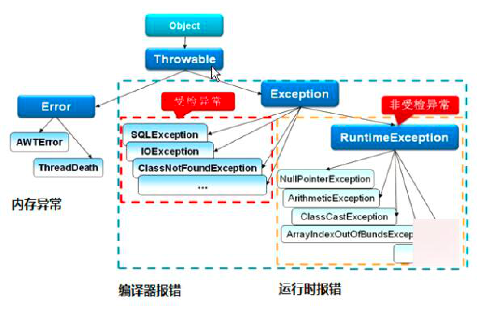
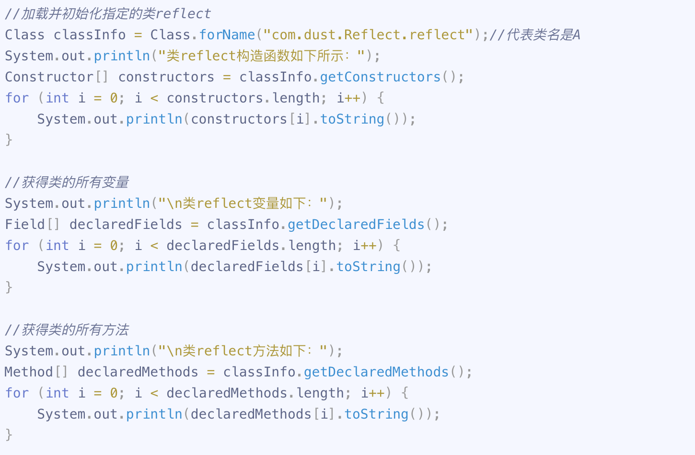
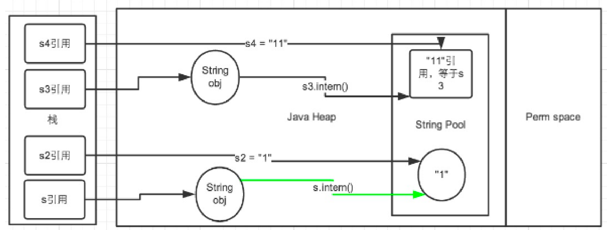

# Java语言基础

## 语法基础

### 面向对象大三特性

- **封装：** 封装是指把属性和方法的实现细节进行隐藏，对属性的访问必须通过公共接口。
- **继承：** 用来扩展一个类，提高代码的复用性，即子类可以继承父类的成员变量和成员方法
- **多态：** 以封装和继承为基础，即运行同一行为作用在不同的对象，具有不同的表现形式

继承在Java中是单一继承，子类只能继承父类的非私有成员变量和方法。

子类对象时绝对大于父类对象的，所谓子类对象只能继承父类非私有的属性及方法的观点是错误的。可以继承，只是无法访问到而已。

### 多态的实现原理

- 多态是指在 **编译层面无法确定最终调用的方法体**， 在运行期由JVM动态绑定，调用合适的重写方法。
  - 由于重载属于静态绑定，本质上 重载结果是完全不同的方法，因此多态一般指的是重写。

**编译时多态：重载**

- 同一个类有多个同名的方法，但是这些方法有着不同的参数，在编译时期就可以确定到底调用哪个方法。

**运行时多态： 重写**

- 子类重写父类的方法，父类的引用变量不仅可以指向父类的实例对象，同时可以指向子类的实例对象。当父类的引用指向子类的对象时，只要在运行时才能确定调用了哪个方法。

### static 

- 修饰类： 静态内部类
- 修饰方法：
  - 静态成员方法属于类，不需要创建对象就可以使用，静态方法里边只能访问所属类的静态成员变量和静态成员方法
- 修饰成员变量那个：
  - 静态变量属于类，只要静态变量所在的类被加载，静态变量就会被分配内存，并且在内存中只有一份，所有的对象共享静态变量
  - 注明： **不能在方法体中定义静态变量**
- 修饰代码块
  - 静态代码块经常用来 **初始化静态变量**， 在类加载的初始化阶段会执行为静态变量赋值的语句和静态代码块的内容，静态代码块只执行一次

### **final/finally/finalize**

**final:**

- 修饰类： 该类不能被继承，类中的方法默认被final修饰
- 修饰方法： 该方法不能被子类重写,但是可以被继承使用
- 修饰变量：
  - 基本数据类型的变量：表示该值在被初始化后不能更改。必须初始化
  - 引用类型： 表示该引用在初始化后不能再指向其他对象。必须初始化

**为什么使用final?**

- 锁定方法，防止任何继承类修改它的实现
- **高效，** 当被一个final修饰的方法，直接讲方法主题插入到调用处，而不进行方法调用

**String类为什么被设计为final类型**

- **字符串常量池的需要**
- **hashCode缓存的需要，因为字符串是不可辨的，因此创建的时候hashCode就被缓存**
- **线程安全：因为同一个字符串可以被多个线程共享，不需要使用线程安全问题而被同步，字符串自己便是线程安全的。**
- **为了防止扩展类无意间破坏了原来方法的实现。**

**finally**

- finally 是一场处理的一部分

**finalize**

- 是Object类的一个方法，在垃圾回收器执行时会调用被回收对象的finalize()方法


### 重写override/ 重载overload

**重载**

- 指的是方法名相同，但是参数类型不同（不同参数类型，不同参数个数，不同参数顺序）。对于编译器来说，方法名称和参数列表组成了一个唯一键，称为方法签名，JVM通过方法签名决定调用哪种方法，属于静态绑定。

**重写**

- 指的是实现接口或者继承父类时，保持方法签名完全相同，实现不同的方法体。元空间有一个方法表保存信息，如果子类重写了父类的方法，则方法表中的方法引用会指向子类实现。

**重写与多态**

非静态方法前面其实有一个默认的对象this，this在构造起他表示正在创建的对象。

因为正在创建的是子类，所以重写的方法执行的是子类重写的代码。

**不可以重写的方法**

- final方法
- 静态static方法
- private等子类中不可见方法，如果重写private方法，相当于是新定义的方法。

**对象的多态性**

- 子类如果重写了父类的方法，通过子类对象调用的一定是子类重写过的代码
- 非静态方法默认的调用对象是this
- this对象在构造器方法中就是正在创建的对象

### 接口和抽象类

**区别**

- 抽象类是对类的 **整体抽象**， 包括属性和行为的抽象，接口只是对行为的抽象。
- 抽象类实现的是继承的关系，父类和派生类之间是 “is -a ”关系，即父类和派生类本质上应该是相同的。
- 接口类体现的是“has - a”关系，实现它的子类可以不存在任何关系。

| 语法     | 抽象类                                             | 接口                                                         |
| -------- | -------------------------------------------------- | ------------------------------------------------------------ |
| 成员变量 | 无特殊要求                                         | 默认是public static final                                    |
| 构造方法 | 有构造方法，**不能被实例化**                       | 没有构造方法                                                 |
| 方法     | 抽象类可以没有抽象方法，但是有抽象方法一定是抽象类 | 默认是public abstract，jdk8支持默认/静态方法，jdk9支持私有方法 |
| 继承     | 单继承                                             | 多继承                                                       |


### 内部类

根据定义的方式的不同可以分为：

- 静态内部类
- 非静态内部类
- 局部内部类
- 匿名内部类

**静态内部类和非静态内部类**

1. 静态内部类不依赖于外部类实例而实例化，非静态内部类需要在外部类实例化后才能被实例化
2. 静态内部类不需要持有外部类的引用，非静态内部类需要持有外部类的引用
3. 静态内部类只能访问外部类的静态成员和静态方法，非静态内部类可以访问外部的静态/非静态成员方法

```java
public class OuterClass {
  
  private static String staticMas = "static Msg";
  
  private String msg = "msg";
  
  // 静态内部类
  public static class NestedStatic {
     // 静态内部类只能访问外部类的静态成员和方啊
    	public void print() {
        	sout(msg); // 这里会编译报错
        	sout(staticMas);
      }
  }
  
  // 非静态内部类 
  public class InnerClass {
     // 非静态内部类可以访问（静态或者非静态的属性和方法）	
      	public void print() {
        	sout(msg); // 这里会编译报错
        	sout(staticMas);
      }
  }
  
  public class Main {
    	psvm() {
        // 创建静态内部类 
        OuterClass.NestedStaticClass s = new OuterClass.NestedStaticClass();
         
        // 创建非静态内部类需要外部类的实例
        OuterClass outer = new OuterClass();
        OuterClass.InnerClass inner = outer.new InnerClass();
        
      }
  }
  
  
}
```

**局部内部类**

1. 在外部类的方法中定义的类，其作用范围是所在的方法内，不能被public private protected修饰
2. 只能访问方法中定义为final类的局部变量

```java
class OuterClass {
	public void fun() {
		// 局部内部类
		class InnerClass {
		
		}
	}
}
```

**匿名内部类**

1. 匿名内部类是在new的后面， **且必须继承一个父类或者实现一个接口，不能有构造函数**
2. 只能创建匿名内部类的一个实例

```java
interface Person {
	public abstact void eat();
}
  public class Main {
    	psvm() {
				Person p = new Person() {
					@Ovveride
					public void eat() {
						sout("eat");
					}
				};
        p.eat();
      }
  }

```


### 强制类型转换

- 当小于int的数据类型（byte/char/short）进行运算时，首先会把这些类型的变量值强制转为int类型，对int类型的值进行计算，最后得到的值也是int类型的。因此如果把2个short类型的值相加，得到的结果是int类型的。

  - ```java
    short s1 = 1; s1 = s1 + 1;// 报错
    short s1 = 1; s1 = (short)(s1 + 1);
    short s1 = 1; s1 += 1;
    
    ```

- 基本数据类型和boolean不能相互转换

- char类型的数据转为高级数据类型时，会转换为对应的ACSII码


### 异常分类与处理



- 异常是指程序运行时发生的错误。

- Error
  - 表示程序在运行期间发生了非常严重的错误，并且该错误是不可恢复的。Error不需要捕捉，如OutofMemoryError
- Exception
  - 可恢复的异常。包括2种类型，检查异常和运行时异常
  - **Check Exception 受检异常（编译阶段）**
    - IOException
    - SQLException
    - FIleNotFoundException
  - RuntimeException **非受检异常（运行阶段，编译器不会检查运行时异常）**


## Java反射机制

**什么是反射？**

在运行状态中，对于任何一个类，能够获取这个类的所有属性和方法，对于任何一个对象，能够调用它的任意一个属性和方法。这种动态获取类的内容和动态调用对象的方法称为反射机制。

通过反射机制相关的API可以获取任何Java类的包括属性、方法、构造器、修饰符等信息。元素不必在JVM运行时进行确定，反射可以使得它们在运行时动态地进行创建和调用。

在JDK中，主要由以下类来实现Java反射机制，这些类都位于Java.lang.reflect包中。

- Class类： 代表一个类
- Constructor类：代表类的构造方法
- Field类：代表类的成员变量
- Mehotd：代表列的方法


### **反射可以用来干什么**

- 在运行时判定任意一个对象所属的类
- 在运行时创建对象
- 在运行时判定一个类所具有的成员变量和方法
- 在运行时调用任意一个对象的方法
- **生成动态代理**

### 反射的实现方式

**获取Class对象的方式**

```java
 1. Class c = Class.forName("com.mysql.jdbc.Driver.class");
 2. Clas c = 类名.class
 3. Class c = 对象名.getClass()；
   //如果是基本类型的包装类，则可以通过包装类的Type属性来获得该包装类的Class对象
 4. Class<?> c = Integer.TYPE; 

```



**获取构造方法的方式**

```java
// 第一种方式
Constructor[] contructors = classInfo.getConstructors();
// 调用两个参数的构造方法
constructors[0].newInstance(new Object[]{"Hello", 2019});
// 调用一个参数的构造放啊
constructors[1].newInstance(new Object[]{"Hello"});
// 调用无参数的构造方法
constructors[2].newInstance();

// 第二种方式
// 调用无参数构造方法
Constructor constructor = classInfo.getConstructor();
constructor.newInstance();
// 调用一个参数的构造方法
constucot = classInfo.getConstructor(new Class[]{String.class});
constructor.newInstance(new Object[]{"Hello"});
// 调用两个参数的构造方法
constructor = classInfo.getCOnstructor(new Class[]{String.class, Integer.class});
constructor.newInstance(new Object[]{"Hello", 2019});
```

**成员方法**

```java
// 调用无参数构造方法，生成实例对象
Object obj = classInfo.getConstructor().newInstance();

// 调用无参数成员函数
Method method1 = classInfo.getMethod("fun1");
// 通过实例对象进行方法的实例化
method1.invoke(obj);

//调用一个参数
Method method2 = classInfo.getMethod("fun2", String.class);
method2.invoke(obj, new Object[]{"Hello"});

// 调用两个参数成员函数
Method method3 = classInfo.getMethod("fun3", String.class, Integer.class);
method3.invoke(obj, new Object[]{"Hello", 2019});
```

### 反射通过方法

功能描述： 只要知道类名字，方法名字符串，方法参数值，运用反射机制就能执行该方法

```java
public static boolean process(String className, String funcName, Object[] para) throws Exception {
  // 获取字节码对象
  Class<?> classObj = Class.forName(className);
  
  // 通过para形成Class类中方法中的参数序列parameterTypes
  // public Method getMethod(String name, Class<?>... parameterTypes)
  Class[] parameterTypes = new Class[para.length];
  for (int i = 0; i < para.length; i++) {
    parameterTypes[i] = para[i].getClass();
  }
  
  
  // 使用无参数构造方法，获得实例对象
  Object obj = classObj.getConstructor().newInstance();
  
  // 获取对象的方法信息
  Method method = classObj.getMethod(funcName, paramterTypes);
  // 调用invoke 方法执行
  method.invoke(obj, para);
  
  return true;
}
```


## 包装类与缓存

### 装箱与拆箱

```java
// 装箱
Integer a = Integer.valueOf(123);
Integer a1 = 123;
Integer in = new Integer("123");

// 拆箱
int a2 = a1; 
int a2 = a1.intValue();
```

### 缓存机制

- 整型、char类型所对应的包装类，在自动装箱时，对于-128-127之间的值会进行缓存处理，从而提高效率

- **缓存的原理：**如果数据在-128-127这个区间内，则在类加载的时候就已经为该区间的每个数值创建了对象，并且把这256个对象都放在一个叫cache的数组中

  ```java
  public static Integer valueOf(int i) {
  	if (i >= IntgerCache.low && i <= IntegrCache.high)
  		return Integer.cache[i + (- IntegerCache.low)];
  	return new Integer(i);.
  }
  ```

- 整型的包装类型的缓存范围在【-128-127】之间，Character类的缓存范围在【0-127】之间。实现缓存机制的包装类只有Integer类可以改变缓存范围。别的都是固定的。

- 当两个Integer类的数值在缓存范围内，会使用同一个Integer对象，通过原始哈希值可以验证
- 当超出缓存范围，则是不同的Integer对象，通过==操作来比较的到false，因为内存地址不同。


## String字符串

### 赋值的两种方式

- string str = "hello";
  - 通过”创建对象的时候，如果字符串常量池存在该字符，直接返回该字符串对象在字符串常量池的地址，否则创建一个新的字符串对象并存储在字符串常量池。“
- String str = new String("hello")
  - JVM首先会先检查字符串常量池
    - 如果该字符串已存在常量池中，那么不再在字符串常量池中创建该字符串对象，而 **直接在堆中复制该对象的副本**，然后将堆中对象的地址赋值给引用str；
    - 如果该字符串不存在常量池中，就会实例化该字符串并且将其放到常量池中，然后在堆中复制该对象的副本，然后将堆中对象的地址赋值给引用str；
- **区别**
  - 存储位置不同：
    - 直接String str = "hello"是存储在常量区的 **字符串常量池**中
    - 而String str = new String("hello")是存储在堆中
  - 创建时间不同：
    - "hello"的方式是在 **编译阶段就创建**
    - new String("hello")是在 **运行时才创建**

### 字符串的连接

```java
String str = "a" + "b"; //纯常量连接，相当于在编译的阶段在常量池中创建了“ab”
String str1 = "a";
String str2 = str1 + "b"; // 变量+常量的操作，会使用StringBuilder的append方法进行拼接
str == str2 // false
str.eaquals(str2) // true

```

**intern**

```java
String hello = new String("Helloworld");
String strIntern = new String("Hello") + new String("world");
strIntern = strIntern // true
```


```java
String hello = "Helloworld"
String hello = new String("Helloworld");
String strIntern = new String("Hello") + new String("world");
strIntern = strIntern // false
```


intern()方法的初衷： 重用String对象，以节省内存消耗。

intern()方法会首先检查字符串常量池中是否有“hello”这个字符串，如果存在，则返回这个字符串的引用，否则将这个字符串加入到字符串池中，然后再返回这个字符串的引用。



```java
// 生成常量池中的“1”， 以及堆中字符串对象，s引用指向堆中字符串对象
String s = new String("1");
// intern()方法检查到常量池中有这个对象，返回字符串常量池中的引用
// s.intern()的返回值指向字符串常量次中的“1”
s.intern();
// 字符串常量池中有“1”，则生成一个s2的引用指向 字符串常量池中的“1”对象
String s2 = "1";

// 这行代码在字符串常量池中生存“1”，并在堆空间中生成s3引用指向的对象（内容为“11”）
// 注意，此时常量池中是没有“11”对象的。
String s3 = new String("1") + new String("1");
// 字符串常量池中没有“11”，将这个字符串加入到字符串常量池中，返回这个字符串的引用（在常量池中国）
s3.intern();
String s4 = "11";
System.out.println(s3 == s4); // false;
System.out.println(s3.intern() == s4); // true

```


### String a = "a" + new String("b")创建了几个对象？

- 常量和常量拼接仍是常量，结果在常量池，只要有变量参与拼接，拼接结果就是变量，存放在堆中
- 使用字面量时至创建一个常量池中的常量，使用new时如果超女两次中没有该值就呼自爱常量池中新创建

### String、StringBUffer、StringBuilder

- String 声明的是不可变对象，每次操作都会生成新的String对象，然后将指针指向新的String对象
- 在经常改变字符串的内容的情况下最好不要使用String
- StringBuffer是线程安全的，StringBuilfer是线程不安全的


## Equals/hashCode

### equals 和==

- == 作用于基本数据类型，比较的是值，作用于对象，比较内存地址
- equals自定义的方法，默认使用了==，。String实现了equals，比较的是值。

### Java中对equals()方法和hashCode()方法的规定

1. equals返回为true， hashCode相同。
2. hashCode不同，equals返回false。
3. 其他都确定

### HashCode

**什么是hashCode**

- hashCode方法是从Object类继承过来的，Object类中的hashCode()方法（native），返回的是 **对象在内存中的地址转换成的int值。**如果对象没有重写hashCOde方法，任何对象的hashCode()方法的返回值都是不相等的。

**为什么重写eqauls()方法的同时，必须重写hashCOde方法**

- 比如在集合set中，往其中放入内容相同的对象，如果没有重写hashCode()方法，那么set中将会放入内容相同的对象。因为如果放入对象时，先调用hashCode()方法得到hashCode值，根据hashCode值计算位置，如果该位置有值，就调用equals()方法判断是否相同。


## 序列化与反序列化

### 定义

序列化： 将java对象转化为 **字节序列** 的过程称为对象的序列化

反序列化： 把 **字节序列** 恢复为java对象的过程称为对象的反序列化

**实现方式：**

- 所有序列化的类都必须实现Serializable接口，当进行序列化的时候，需要用到ObjectOutputStream里面的writeObject（）;当进行反序列化的时候，需要用到ObjectInputStream里面的readObject()方法。

**序列化的特点：**

- 序列化时，只对对象的状态进行保存，而不管对象的方法。
- 当一个父类实现序列化时，子类自动实现序列化，不需要显示实现Serializable接口。
- 当一个对象的实例变量引用了其他对象时，序列化该对象时，也把引用对象进行序列化
- 对象中被static或者transient修改的变量，在序列化时其变量值不被保存。

**序列化的好处：**

- 实现了数据的持久化，即通过序列化可以把数据永久地保存到硬盘上。
- 利用序列化实现远程通信，在网络中传送对象的字节序列。

**注意事项：**

1. **为什么要显示的声明serialVersionUID**

- 提高程序的运行效率，如果没有显示声明则会序列化期间计算该值。
- 防止java.io.InvaildClassException异常。如果没有提供，编译器会把对象的hashCode值座位serialVersionUID，如果加入新的成员遍历那个，则会发生变化，在反序列化的时候就会报错。

2. **ArrayList和LinkedLIst能否序列化**

- 都可以序列化，但是ArrayList把元素数组elementData声明为transient, 仅仅序列化已经保存的数据。
- 可以通过自定义readObject,writeObject()完成数组元素的自定义序列化动作。

## 泛型

**定义：** 范型的本质是参数化类型，解决不确定对象具体类型的问题

**泛型的好处：**

- 类型安全，放置什么出来什么，不存在ClassCastException
- 提升可读性，编码阶段显示知道泛型集合，范型方法等处理的对象类型
- 代码复用，合并了同类型的处理代码

### 泛型擦除

泛型用于编译阶段，编译后的字节码文件不包含泛型类型信息，因为虚拟机没有泛型类型对象，所有对象都属于普通类。即泛型信息在编码阶段被擦除。

