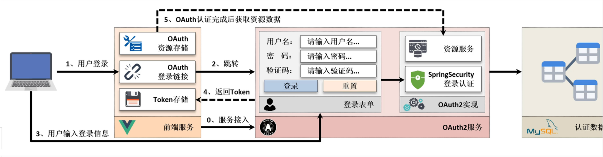
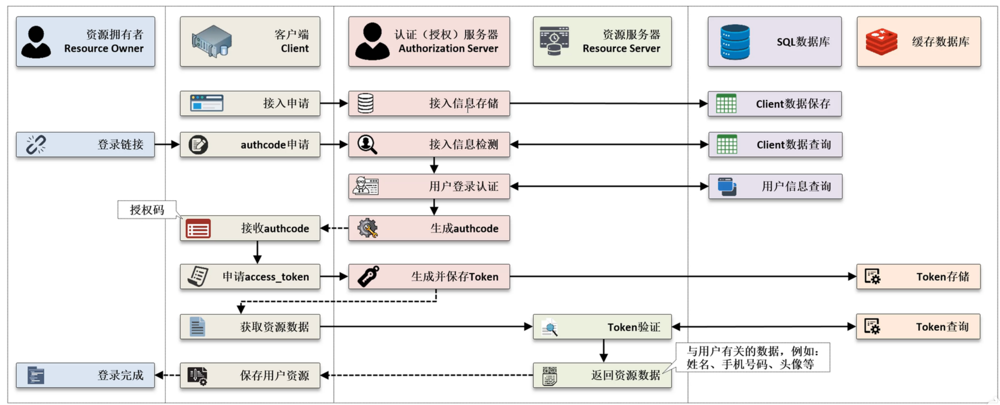
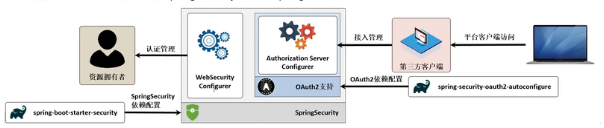

# 前言

要理解OAuth2，就要了解SSO的概念（单点登录技术），在一个大规模的集群环境之中，可以构建一个统一的认证服务器，而这个认证服务器可以为集群之中的所有服务节点提供认证处理

**单点登录核心的概念在于认证操作，但是对于现阶段来讲如果希望单点登录可以实现更多的功能，那么也可以使用各种数据传输的方式完成。**

SSO早期的实现使用的是CAS，由耶鲁大学开发的，但是这个组件非常难使用，要求开发者需要使用大量的配置修改，不同的CAS版本配置不同，维护和更新都不方便，最方便的是开发者自己维护的程序代码，为了可以解决这样的问题，才有了OAuth2标准。

OAuth协议是一个关于用于资源授权访问的开放网络标准，具有较高的安全性和简易性，在全世界被广泛使用，目前的最新版本是2.0版本。在OAuth协议处理中不会使用第三方触及到用户的账户信息，这样第三方应用无需使用用户名和密码即可获取该用户相关资源授权。

原始访问路径： jd.com - > 站点重定向：

假设用户访问的是“yootk.com“的站点，但是一点登录之后需要让其跳转到“muyan.com"的站点进行认证处理，于是在“muyan.com"站点之中就会出现由用户的认证表单填写（用户名、密码、手机、验证码），而登录成功之后会返回到原始的路径，本次会返回到"yootk.com",为了可以清楚的描述出用户已经登录过了，所以会由“muyan.com”返回一个token数据，然后随后可以利用token数据获取相应的资源了。

在OAuth2之中存在四个身份：

**1. 资源拥有者：** 就是指要进行登录认证的用户，是登录；登录数据资料的提供者；

**2. 客户端：** 也被称为第三方应用，用户最终要访问的应用资源；

**3. 认证或授权服务器：** 用于提供认证服务，包括系统接入处理、用户登录表单、资源服务信息、以及客户端Token数据管理，这样客户端就可以通过Token获取用户授权的访问资源；

**4. 资源服务器：**利用得到的Token获取相关用户资源数据；

## 具体内容

如果想要进行OAuth2的搭建只需要按照既定的OAuth2实现细节进行程序的开发即可。本次通过SpringSecurity并结合SpringBoot进行OAuth2服务搭建。

本次的项目开发架构： SpringBoot+ SpringSecurity + OAuth2+ Druid + SpringDataJPA+Redis。